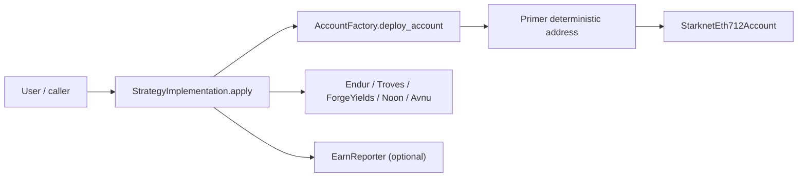
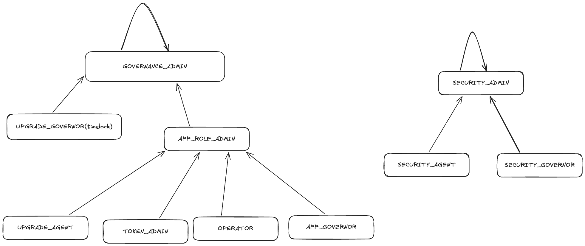

# Earn Contracts

Cairo/Scarb contracts for the Karnot Earn portal. The repo centers around
deterministic Starknet accounts owned by Ethereum addresses, plus strategy
contracts that apply user deposits into supported Earn products.

## What This Repo Contains

This is a Scarb workspace with the following packages:

| Package | Purpose |
| --- | --- |
| `contracts` | Shared base contracts. Currently contains `Primer`, a tiny deterministic deployment target that can replace its class hash once. |
| `eth_712_account` | Starknet account contract initialized with an Ethereum address. It validates transactions and `execute_from_outside_v2` calls with EIP-712 secp256k1 signatures. |
| `account_factory` | Deploys deterministic user account contracts for Ethereum addresses. It deploys `Primer`, replaces it with the current account class, then initializes the account. |
| `strategy_implementation` | Main Earn entrypoint. Pulls user funds, deploys or reuses the position-owner account, applies the selected strategy, and optionally reports orders. |
| `earn_reporter` | Lightweight event reporter for created orders. |
| `testing_utils` | Test-only helpers, mock contracts, constants, and event helpers used across packages. |
| `scripts` | Repo-level operational scripts, including Primer class-hash verification. |

## High-Level Flow



1. The caller approves `StrategyImplementation` to spend `token_in`.
2. The caller calls `StrategyImplementation.apply(token_in, amount, parameters)`.
3. `parameters` encodes:
   - `eth_address`
   - account ownership signature: `[r_high, r_low, s_high, s_low, v]`
   - `chain_id`
   - `protocol`
   - optional strategy payload, currently used by Avnu
4. `StrategyImplementation` transfers `amount` from the caller to itself.
5. `AccountFactory` computes the deterministic position-owner account address for
   the Ethereum address. If it is not deployed yet, it deploys `Primer`, upgrades
   it to `StarknetEth712Account`, then initializes it.
6. The strategy is applied:
   - `ENDUR`: deposit supported wrapper token into the Endur vault.
   - `TROVES`: deposit wrapper token into Endur first, then deposit the received
     LST into the matching Troves vault.
   - `FORGE_YIELDS`: WBTC-only vault deposit.
   - `NOON`: WBTC-only vault deposit.
   - `AVNU`: execute AVNU multi-route swap, currently validating that the buy
     token is `MIDAS_RE7_BTC` and the beneficiary is `StrategyImplementation`.
7. If the internal strategy call fails, `StrategyImplementation` refunds the
   original `token_in` amount to the position-owner account and emits `ApplyFailed`.
8. If an Earn reporter is configured, `OrderCreated` is emitted through
   `EarnReporter`.

## Supported Protocols And Tokens

Protocol selectors are felt short strings in
`strategy_implementation/src/utils.cairo`.

| Protocol | Supported token input |
| --- | --- |
| `ENDUR` | `WBTC`, `TBTC`, `SOLVBTC`, `LBTC` |
| `TROVES` | `WBTC`, `TBTC`, `SOLVBTC`, `LBTC` |
| `FORGE_YIELDS` | `WBTC` only |
| `NOON` | `WBTC` only |
| `AVNU` | Validated by the serialized Avnu payload instead of the token enum |

Concrete Starknet addresses for tokens, vaults, and AVNU live in
`strategy_implementation/src/known_addresses.cairo`.

## Setup

Tool versions are pinned in `.tool-versions`:

```sh
asdf install
scarb --version
snforge --version
sncast --version
```

Expected versions:

- Scarb: `2.14.0`
- Starknet Foundry: `0.54.1`

If `snforge` or `sncast` is missing, install the pinned Starknet Foundry version
through `asdf`. If that exact version is unavailable locally, update the asdf
plugin index or ask the team before changing `.tool-versions`.

## Common Commands

Build the workspace:

```sh
scarb build
```

Run all Starknet Foundry tests:

```sh
snforge test
```

Run a package test script from a package directory:

```sh
cd strategy_implementation
scarb run test
```

Format Cairo:

```sh
scarb fmt
```

Verify the pinned Primer class hash:

```sh
scripts/verify_primer_class_hash.sh
```

## Important Contracts

### `Primer`

`contracts/src/primer/primer.cairo`

`Primer` stores the deployer address in its constructor and allows only that
deployer to call `set_class_hash`. It is used so the account factory can deploy a
minimal contract at a deterministic address, then replace it with the real
account implementation.

Do not casually change `contracts/Scarb.toml`, `Primer`, or release build
settings. `account_factory/src/utils.cairo` hardcodes the production
`PRIMER_CLASS_HASH`, and `scripts/verify_primer_class_hash.sh` checks it.

### `StarknetEth712Account`

`eth_712_account/src/eth_712_account.cairo`

Account contract with:

- SRC6 account validation and execution.
- SRC9 v2 `execute_from_outside_v2`.
- EIP-712 transaction and outside-execution hashing.
- Ethereum secp256k1 signature recovery.
- Self-only upgrade flow, with optional EIC initialization data.

Python helpers in `eth_712_account/scripts` mirror the Cairo EIP-712 hashing
logic:

- `eip712.py`: shared hashing/signature utilities.
- `send_tx.py`: signs and sends InvokeV3 transactions or prints EFO calldata.
- `generate_test_signatures.py`: regenerates signatures embedded in tests.

### `AccountFactory`

`account_factory/src/account_factory.cairo`

The factory stores the current account class hash. App governance can update it,
but existing deployed accounts are reused at their deterministic address. New
Ethereum addresses receive the latest configured account class hash.

### `StrategyImplementation`

`strategy_implementation/src/strategy_implementation.cairo`

This is the main Earn execution surface. It:

- pulls funds from the caller;
- deploys or reuses the position-owner account;
- decodes the requested protocol;
- calls the target vault/swap;
- refunds on safe-dispatch failure;
- emits strategy events;
- optionally reports via `EarnReporter`.

Most protocol selection logic is in `strategy_implementation/src/utils.cairo`.
Most real-world addresses are in `strategy_implementation/src/known_addresses.cairo`.

### `EarnReporter`

`earn_reporter/src/earn_reporter.cairo`

Emits normalized `OrderCreated` events for deposits and withdrawals. The current
strategy code reports deposits. Reporter upgrades are owner-gated.

## Access Control

`AccountFactory` and `StrategyImplementation` both embed the shared
`RolesComponent` from `starkware_utils`, together with OpenZeppelin
`AccessControlComponent` and `ReplaceabilityComponent`.

The role hierarchy is inherited from
`starkware_utils/src/components/roles/interface.cairo`:

| Role | Role Admin |
| --- | --- |
| `GOVERNANCE_ADMIN` | `GOVERNANCE_ADMIN` |
| `UPGRADE_GOVERNOR` | `GOVERNANCE_ADMIN` |
| `UPGRADE_AGENT` | `APP_ROLE_ADMIN` |
| `APP_ROLE_ADMIN` | `GOVERNANCE_ADMIN` |
| `APP_GOVERNOR` | `APP_ROLE_ADMIN` |
| `OPERATOR` | `APP_ROLE_ADMIN` |
| `TOKEN_ADMIN` | `APP_ROLE_ADMIN` |
| `SECURITY_ADMIN` | `SECURITY_ADMIN` |
| `SECURITY_AGENT` | `SECURITY_ADMIN` |
| `SECURITY_GOVERNOR` | `SECURITY_ADMIN` |



### AccountFactory Access Control

`AccountFactory` initializes roles with `governance_admin`, initializes
replaceability with `upgrade_delay`, and stores the initial account class hash:

```cairo
self.roles.initialize(:governance_admin);
self.replaceability.initialize(:upgrade_delay);
self.account_class_hash.write(account_class_hash);
```

Functions by role:

| Role | Functions |
| --- | --- |
| `APP_GOVERNOR` | `set_account_class_hash` |
| `UPGRADE_GOVERNOR` | `add_new_implementation`, `remove_implementation` through `ReplaceabilityComponent` |
| `UPGRADE_GOVERNOR` or `UPGRADE_AGENT` | `replace_to` through `ReplaceabilityComponent` |
| No role required | `account_class_hash`, `deploy_account` |

`set_account_class_hash` changes the account implementation used for future
accounts only. Already deployed accounts are reused at their deterministic
address.

### StrategyImplementation Access Control

`StrategyImplementation` uses the same role and replaceability stack as
`AccountFactory`.

Functions by role:

| Role | Functions |
| --- | --- |
| `APP_GOVERNOR` | `set_earn_reporter` |
| `UPGRADE_GOVERNOR` | `add_new_implementation`, `remove_implementation` through `ReplaceabilityComponent` |
| `UPGRADE_GOVERNOR` or `UPGRADE_AGENT` | `replace_to` through `ReplaceabilityComponent` |
| No role required | `apply`, `account_factory`, `earn_reporter` |
| Self only | `apply_on_self` |

`apply_on_self` is exposed through the interface for safe-dispatch handling, but
it checks that the caller is the strategy contract itself:

```cairo
let contract_address = get_contract_address();
assert(get_caller_address() == contract_address, 'ONLY_SELF_CALLER');
```

### Other Contract Access Control

| Contract | Access model |
| --- | --- |
| `EarnReporter` | Ownable. `upgrade` is owner-only. `report_order_created` is public and records `caller_address`, so indexers should filter trusted reporter callers. |
| `StarknetEth712Account` | No role hierarchy. `upgrade` is self-only, so it must be executed by the account itself through a signed account call or outside execution. |
| `Primer` | No role hierarchy. `set_class_hash` is deployer-only and is used by `AccountFactory` immediately after deterministic deployment. |

### Operational Wallet Guidance

Recommended wallet setup:

| Role | Suggested holder |
| --- | --- |
| `GOVERNANCE_ADMIN` | Multisig or governance timelock. This is the top-level role admin. |
| `APP_ROLE_ADMIN` | Multisig. It can appoint app governors and upgrade agents. |
| `UPGRADE_GOVERNOR` | Multisig or timelock. It schedules/removes implementations. |
| `APP_GOVERNOR` | Multisig or tightly controlled warm multisig. It can change future account class hash and reporter address. |
| `UPGRADE_AGENT` | Warm ops wallet only when `upgrade_delay` is nonzero and implementations are scheduled by multisig governance. Avoid a hot EOA if `upgrade_delay` is zero. |
| `OPERATOR`, `TOKEN_ADMIN`, `SECURITY_AGENT`, `SECURITY_GOVERNOR` | Present in the shared role system, but not used by custom functions in this repo today. Assign only if future code needs them. |
| `EarnReporter` owner | Multisig, because it can upgrade the reporter implementation. |

## Test Coverage Map

Start here when onboarding:

| File | What it proves |
| --- | --- |
| `contracts/src/test.cairo` | Primer access control and class replacement. |
| `account_factory/src/test.cairo` | Deterministic account deployment, class-hash updates, and account reuse. |
| `eth_712_account/src/test.cairo` | EIP-712 validation, EFO, nonces, chain separation, upgrades, and execution. |
| `strategy_implementation/src/test.cairo` | Deposit routing, refunds, Avnu validation, reporter integration, and failure events. |
| `earn_reporter/src/test.cairo` | Order event shape, owner transfer, and upgrade permissions. |

## Gotchas

- `Primer` class hash stability matters. Build profile, Scarb version, and
  contract code all affect it.
- Account initialization ownership signatures are 5 felts. Runtime account and
  EFO signatures are 6 felts because the EVM chain id is appended.
- `StrategyImplementation.apply` returns early for `amount == 0`.
- Strategy failures are intentionally handled through a safe dispatcher so the
  original token can be refunded and `ApplyFailed` can be emitted.
- `FORGE_YIELDS` and `NOON` only accept WBTC.
- Avnu payload validation is strict: sell token must match `token_in`, buy token
  must be `MIDAS_RE7_BTC`, and beneficiary must be the strategy implementation
  contract.